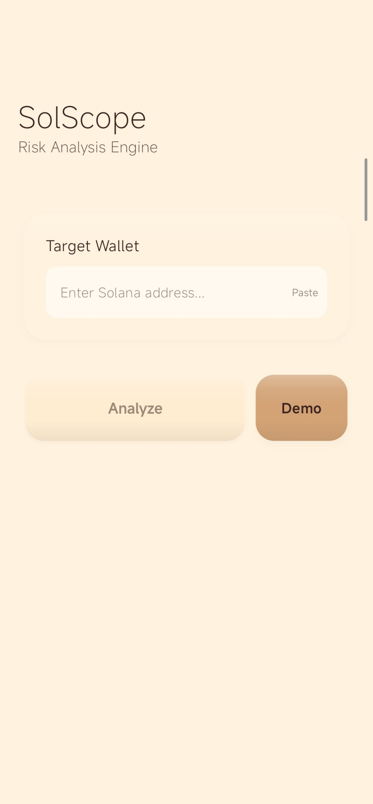
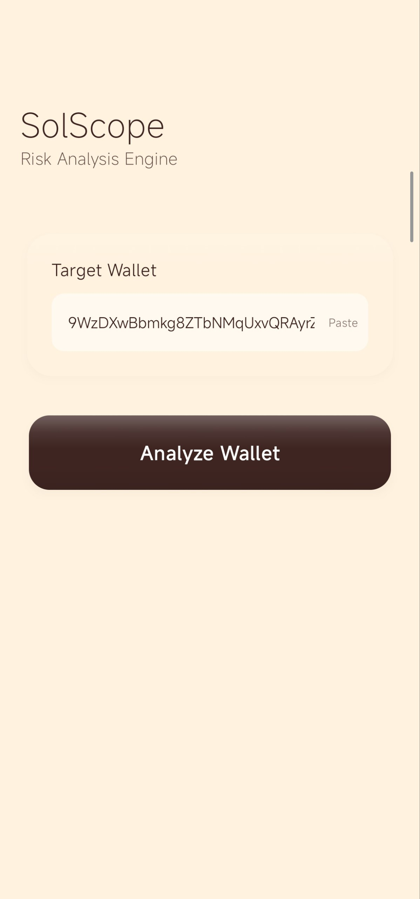
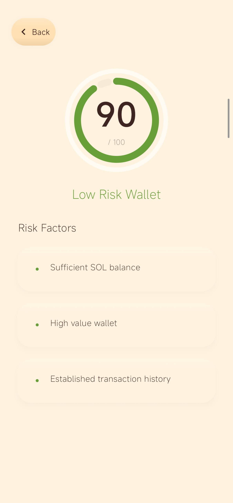
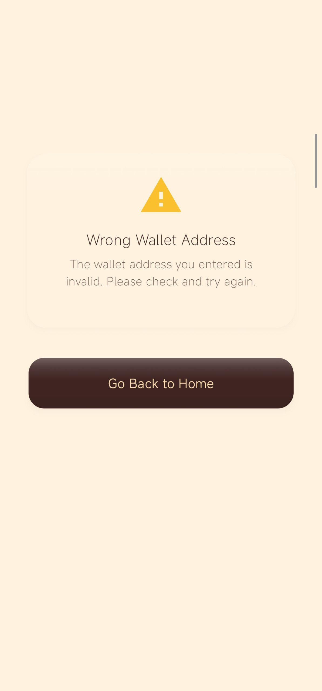
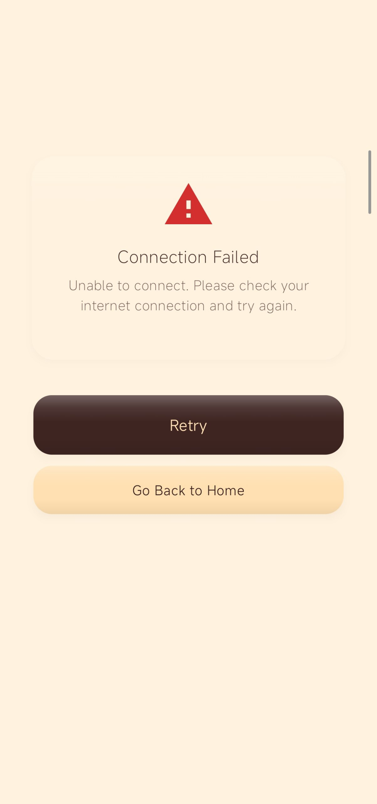

# SolScope

Native Android app that analyzes Solana wallet activity and generates explainable risk scores. Built with Kotlin and Jetpack Compose.

## Screenshots

<p align="center">
  
  &nbsp;&nbsp;
  
  &nbsp;&nbsp;
  
</p>

<p align="center">
  <em>Home screen with wallet input</em>
  &nbsp;&nbsp;&nbsp;&nbsp;&nbsp;&nbsp;&nbsp;&nbsp;&nbsp;&nbsp;&nbsp;&nbsp;&nbsp;&nbsp;
  <em>Address pasted, ready to analyze</em>
  &nbsp;&nbsp;&nbsp;&nbsp;&nbsp;&nbsp;&nbsp;&nbsp;&nbsp;&nbsp;&nbsp;
  <em>Risk score with detailed factors</em>
</p>

<p align="center">
  
  &nbsp;&nbsp;
  
</p>

<p align="center">
  <em>Invalid address detection</em>
  &nbsp;&nbsp;&nbsp;&nbsp;&nbsp;&nbsp;&nbsp;&nbsp;&nbsp;&nbsp;&nbsp;&nbsp;&nbsp;&nbsp;&nbsp;&nbsp;&nbsp;&nbsp;&nbsp;&nbsp;&nbsp;&nbsp;&nbsp;&nbsp;
  <em>Network error with retry option</em>
</p>

## About

Paste any Solana wallet address and SolScope pulls on-chain data directly from Solana RPC, runs it through a rule-based risk engine, and gives you a score from 0–100 with clear reasons explaining the rating.

Built for anyone who wants to check a wallet before interacting with unknown tokens, NFT projects, or DeFi protocols.

## Features

- **Wallet Risk Scoring** — Analyzes transaction history, balance patterns, program interactions, and account age
- **Explainable Results** — Every score comes with specific risk factors, not just a number
- **Direct RPC** — Talks to Solana mainnet directly, no backend or third-party APIs needed
- **Claymorphic Design** — Custom 3D UI system with soft depth, spring animations, and gradient effects
- **Smart Errors** — Classifies failures (bad address, network, rate limits) with contextual recovery actions
- **Demo Mode** — One-tap demo with a pre-loaded wallet address for quick testing
- **Clipboard Paste** — Instant paste from clipboard

## Architecture

```
presentation/            Compose UI
  ├── home/              Wallet input screen
  ├── result/            Score display, loading, error states
  ├── components/        ClayButton, ClayCard (reusable 3D components)
  └── theme/             Autumn color palette + tokens

domain/                  Business logic
  ├── model/             ResultState, WalletSnapshot, ErrorType
  └── risk/              Rule-based risk engine + scoring

data/
  └── rpc/               Solana JSON-RPC client + snapshot builder
```

## Risk Engine

| Signal             | What It Checks                              |
| ------------------ | ------------------------------------------- |
| Balance            | Zero or very low SOL balance                |
| Account Age        | Wallet age based on first transaction       |
| Transaction Volume | Total historical transactions               |
| Activity Patterns  | Frequency and recency of usage              |
| Program Usage      | Interactions with risky or unusual programs |

Scoring is intentionally conservative — flags potential risks rather than making absolute judgments.

## Design Language

The UI uses a claymorphism approach — soft, tactile elements with depth:

- **Palette:** Autumn warm tones — cream, dark brown, tan, peach, sage
- **Depth:** Material shadows + inner gradient highlights for a puffy 3D feel
- **Motion:** Spring-based bounce on press, gradient sweep animations
- **Errors:** Context-aware screens — wrong address gets "Go Back", network errors get "Retry"

## Tech Stack

- Kotlin
- Jetpack Compose + Material 3
- Solana JSON-RPC (raw HTTP, no SDK)
- MVVM with StateFlow
- Custom composables (ClayButton, ClayCard)

## Build & Run

```bash
git clone https://github.com/RustamSheoran/solscope-android.git
cd solscope-android
./gradlew installDebug
```

Requires Android Studio with API 24+ target.

## What's Next

Core analysis is live on mainnet. Planned:

- Token-level risk analysis
- Historical trend tracking
- Wallet comparison

## License

MIT
